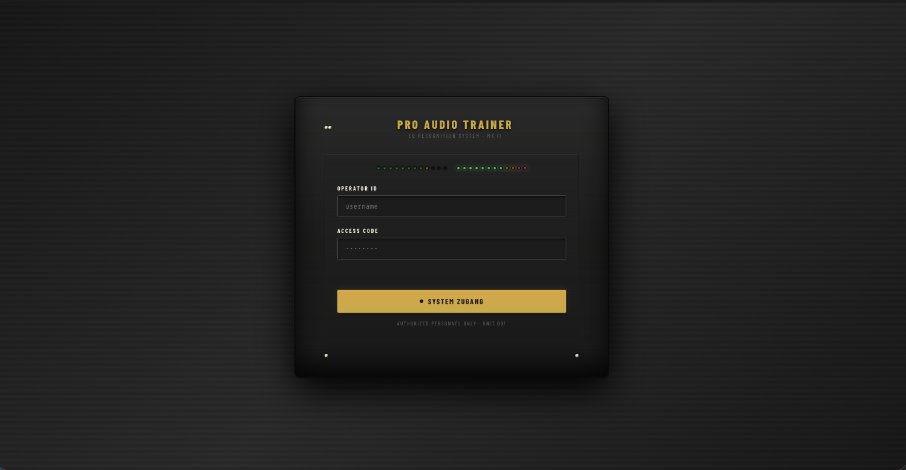
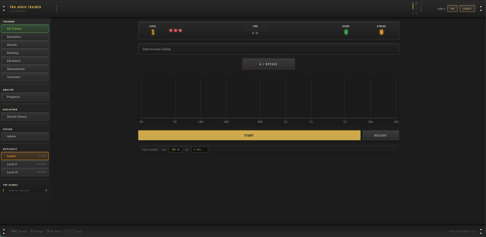
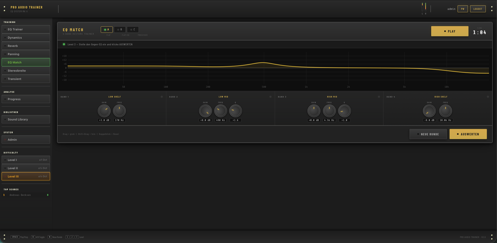
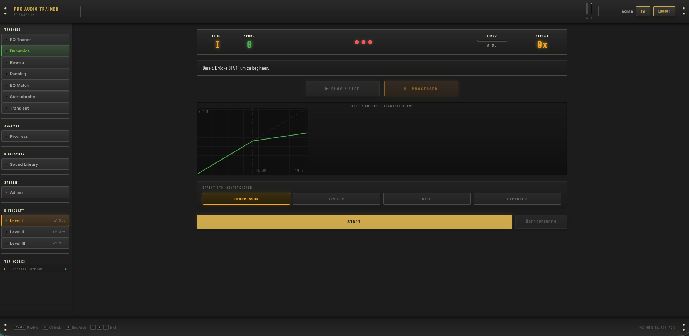
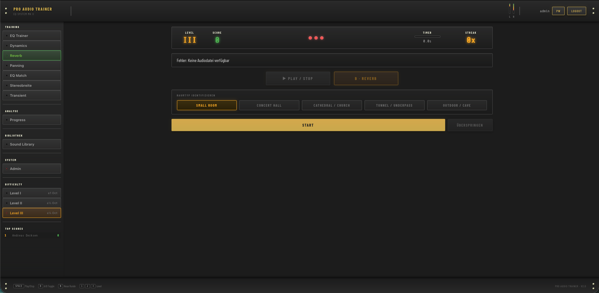
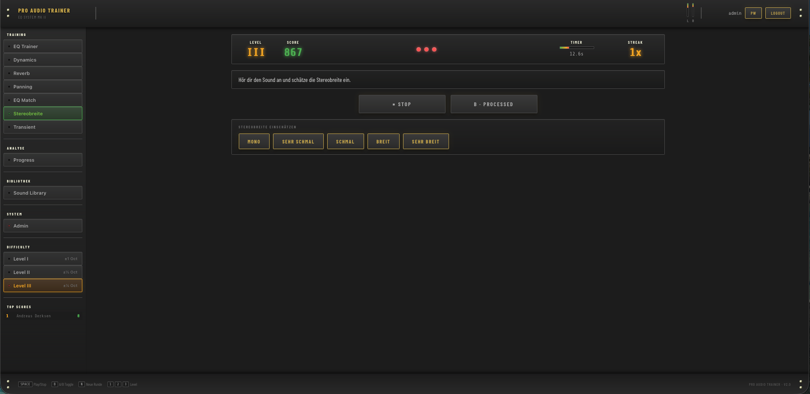
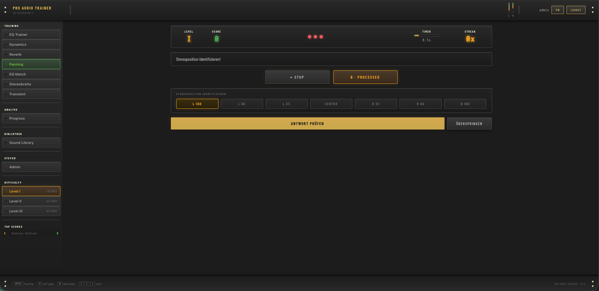
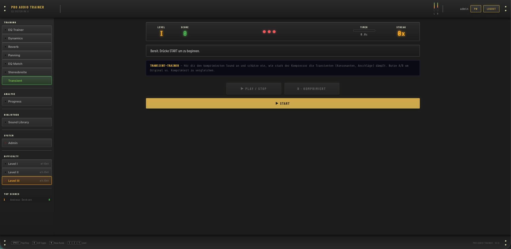
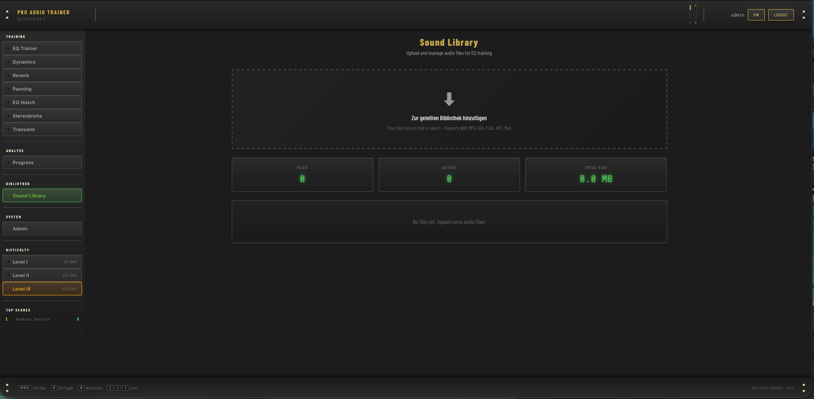

# ProAudioTrainer v2

**Web-based ear training for mixing engineers and audio professionals.**

Train your ears to recognize frequencies, dynamics, reverb character, stereo width, transients, and panning — with reproducible A/B exercises built around real studio workflows.

[](LICENSE)
[](https://nodejs.org)
[](docker-compose.yml)
[](CONTRIBUTING.md)

---

## Why ProAudioTrainer?

Most ear training tools are either too gamified or too theoretical.
ProAudioTrainer focuses on **real studio decisions**: clear references, measurable precision, and trackable progress — the same workflow you use when mixing professionally.

Upload your own reference tracks, train on real impulse responses from real spaces, and see your improvement over time with per-module score history.

---

## Screenshots

| Login | EQ Trainer | EQ Match |
|---|---|---|
|  |  |  |

| Dynamics | Reverb | Stereo Width |
|---|---|---|
|  |  |  |

| Panning | Transient | Sound Library |
|---|---|---|
|  |  |  |

---

## Training Modules

| Module | What you train | Difficulty levels |
|---|---|---|
| **EQ Trainer** | Identify which frequency band is boosted/cut | 3 (±1 oct → ±0.25 oct) |
| **EQ Match Trainer** | Replicate a target EQ curve by ear (A/B) | 3 (visual → blind) |
| **Dynamics Trainer** | Distinguish compressor, limiter, gate, expander | 3 (obvious → subtle) |
| **Reverb Trainer** | Classify room character: cathedral, hall, room, tunnel, outdoor | Single (80+ real IRs) |
| **Stereo Trainer** | Perceive stereo width differences via M/S processing | 3 intensity levels |
| **Panning Trainer** | Identify L/C/R placement in the stereo field | 3 levels |
| **Transient Trainer** | Hear attack/decay characteristic changes | 3 levels |
| **Sound Library** | Upload, organize, and reuse your own reference audio | — |
| **Progress Dashboard** | View score history, training trends, and module stats | — |

---

## Tech Stack

| Layer | Technology |
|---|---|
| Frontend | Vanilla JavaScript, HTML5, CSS3 |
| Audio Engine | Web Audio API — BiquadFilter, AnalyserNode, AudioWorklets |
| Audio Library | [Tone.js](https://tonejs.github.io/) (pre-bundled) |
| Impulse Responses | [EchoThief](http://www.echothief.com/) — 148 real-world IRs |
| Backend | Node.js 20 + Express |
| Auth | JSON Web Tokens (JWT) + bcrypt |
| Storage | JSON files + filesystem uploads (Docker volume) |
| Deployment | Docker Compose + Nginx reverse proxy |

---

## Quick Start

**Requirements:** Docker + Docker Compose

```bash
# 1. Clone the repository
git clone https://github.com/janwiebe05/ProAudioTrainer.git
cd ProAudioTrainer

# 2. Create environment file
cp .env.example .env

# 3. Start the stack
docker compose up -d --build

# 4. Open in your browser
open http://localhost:8090
```

Default credentials (change immediately after first login):
- Username: `admin`
- Password: `admin1!`

---

## Local Development (without Docker)

**Backend:**

```bash
cd backend
npm install
npm run dev   # nodemon, port 3001
```

**Frontend:**

The frontend is static HTML/CSS/JS. Serve it with any static server or use the Docker setup.
The Nginx config in `nginx/nginx.conf` proxies `/api/` to the backend automatically.

---

## Project Structure

```
backend/
  src/
    data/           # JSON persistence (gitignored — auto-created by server)
    middleware/     # JWT auth, error handler, ownership guard
    repositories/   # Data access layer (users, scores, library, exercises)
    routes/         # Express API routes (one file per trainer module)
    services/       # Business logic (auth, scoring, progress, admin)
    utils/          # JSON store helper, input validators
  uploads/          # User audio files (gitignored — persisted via Docker volume)
  server.js         # Express app entry point

frontend/
  modules/          # One JS file per trainer module (self-registering)
  worklets/         # Custom AudioWorklet processors (gate, expander, MS-width)
  EchoThief/        # 148 impulse response WAV files (real-world locations)
  app.js            # App controller: auth flow, module loader, VU meters
  index.html        # Single-page app shell (vintage rack unit aesthetic)
  style.css         # Core styles
  style-modules.css # Module-specific component styles

nginx/
  nginx.conf        # Reverse proxy config (API + static file serving)
  Dockerfile

docs/
  screenshots/      # Interface screenshots and GIFs
```

---

## API Reference

### Authentication
| Method | Endpoint | Description |
|---|---|---|
| POST | `/api/auth/login` | Authenticate user, receive JWT |
| POST | `/api/auth/verify` | Verify token validity |
| POST | `/api/auth/register` | Create new account |
| POST | `/api/auth/change-password` | Update password |

### Sound Library
| Method | Endpoint | Description |
|---|---|---|
| GET | `/api/library` | List uploaded audio files |
| POST | `/api/library/upload` | Upload audio file(s) (multipart, max 200MB) |
| GET | `/api/library/:id/audio` | Stream audio file |
| DELETE | `/api/library/:id` | Delete audio file |
| PATCH | `/api/library/:id` | Update file metadata |

### Trainer Exercises
| Method | Endpoint | Description |
|---|---|---|
| GET | `/api/eq-match/random?level=1\|2\|3` | Random EQ exercise |
| POST | `/api/eq-match/evaluate` | Evaluate EQ match answer |
| GET | `/api/dynamics/random?level=1\|2\|3` | Random dynamics exercise |
| GET | `/api/reverb/random` | Random reverb exercise (IR-based) |
| GET | `/api/panning/random?level=1\|2\|3` | Random panning exercise |
| GET | `/api/stereo/random?level=1\|2\|3` | Random stereo width exercise |
| GET | `/api/transient/random?level=1\|2\|3` | Random transient exercise |

### Scores & Progress
| Method | Endpoint | Description |
|---|---|---|
| POST | `/api/scores` | Submit exercise score |
| GET | `/api/scores/highscores` | Top 10 global leaderboard |
| GET | `/api/progress/overview` | Per-user training statistics |

### Admin
| Method | Endpoint | Description |
|---|---|---|
| GET | `/api/admin/users` | List all users |
| POST | `/api/admin/users` | Create user |
| DELETE | `/api/admin/users/:id` | Delete user |
| GET | `/api/health` | Service health check |

---

## Scoring System

Each trainer uses a combined time + precision score:

```
points = maxPoints × timeFactor × precisionFactor
```

- **timeFactor**: Linear decay from 1.0 (instant answer) to 0.1 (timeout)
- **precisionFactor**: Based on distance from correct value (e.g., semitones off for EQ)
- Scores are persisted server-side per user and contribute to module-level leaderboards

---

## Roadmap

- [ ] Spotify integration for reference-track A/B workflows (see [issue template](.github/ISSUE_TEMPLATE/feature_spotify_integration.md))
- [ ] Extended analytics with learning curves per module
- [ ] Genre-specific training presets (mastering, broadcast, film)
- [ ] Optional database backends (PostgreSQL / S3)
- [ ] Automated test coverage for scoring engine and audio processing

---

## Contributing

See [CONTRIBUTING.md](CONTRIBUTING.md) for setup instructions, coding guidelines, and the PR checklist.

For security issues, see [SECURITY.md](SECURITY.md).

---

## Credits

Impulse response audio files are from the **[EchoThief Impulse Response Library](http://www.echothief.com/)** by Greg Hopkins, licensed under [Creative Commons Attribution 4.0](https://creativecommons.org/licenses/by/4.0/).

---

## License

MIT — see [LICENSE](LICENSE).
